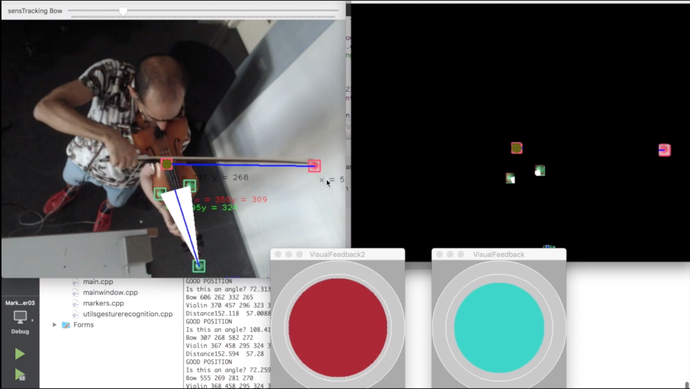

# Extraction and Recognition of Violin Gestures on Music Performance

This repository include the final thesis project of the Bachelor's
degree in Audiovisual Systems Engineering - Universitat Pompeu Fabra, Barcelona 2017 - 2018. 

QtCreator interface, extraction and recognition of markers to estimate violin position
and skewness angle of violin and bow setup. The interdemoImage.pngface is based on Computer Vision technology (using OpenCV library).
This interface represent a low cost solution 

  

Requirements: 

QtCreator / One webcam / Markers (Small color balls)

Dissertation is available here: 
[Nou Plana, Ignasi. Extraction and recognition of violin
gestures on music
performance. 2019](https://repositori.upf.edu/bitstream/handle/10230/42561/Nou_2019.pdf?sequence=1&isAllowed=y)

## Installation

This QtCreator interface is a prototype, in order to install it and use it, 
create a new Qt project and copying and pasting the documents should work.

Remember to install some of the external libraries required.

## Usage: 

Open the interface, detect the color of your marker, start tracking. Visual feedback is shown during the tracking.

## DEMO: 

[Video, Setup Overview](https://drive.google.com/open?id=1FVKPtLDyy3RMEU5OFau-LhregT7pCoRd)

## License:

[gpl-3.0](https://choosealicense.com/licenses/gpl-3.0/)
